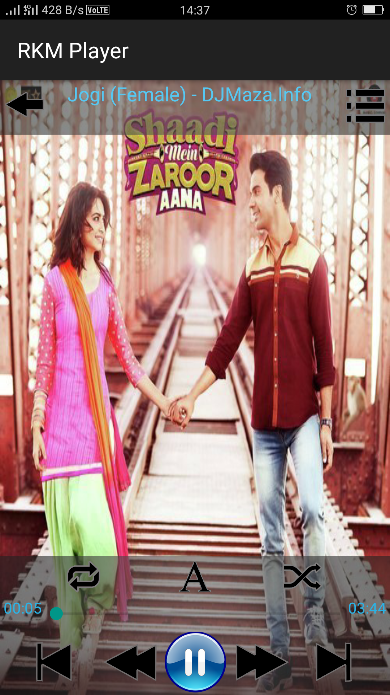
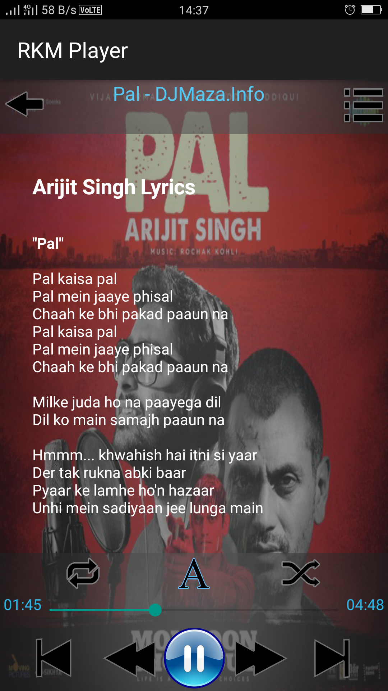

# Android Application Development 

The Application provides a user-friendly interface to play music files in any android powered device. It has various features like online lyrics fetching, auto addition of all music files of various formats from internal/external storages on the device and other advanced features.

# Screen Shots

